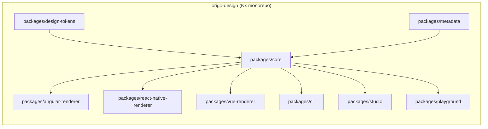
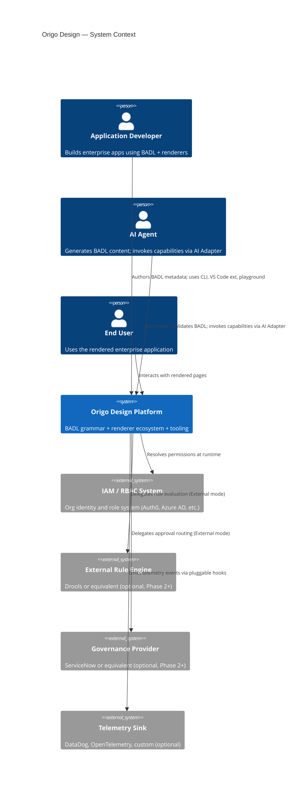

# Architecture Spine — Origo Design (Full Platform, Phase 1–4)

## Design Paradigm

**Layered Hexagonal with Versioned Language Contract.**

`@origo/core` is the hexagonal core: a versioned language standard (BADL — Business Application Description Language) with no runtime framework dependencies. Six concentric dependency rings radiate outward; each ring depends only on rings interior to it.

```mermaid
graph TD
    subgraph core["@origo/core (BADL Grammar — innermost ring)"]
        O[Business Outcomes]
        C[Capability Contracts]
        R[Business Rules]
        IC[Interaction Contracts]
    end
    subgraph adapters["Experience Adapters (ring 5)"]
        WA[Web Adapter]
        MA[Mobile Adapter]
        AA[AI Agent Adapter]
    end
    subgraph renderers["Renderers (ring 6 — outermost)"]
        AR[@origo/angular-renderer]
        RNR[@origo/react-native-renderer]
        VR[@origo/vue-renderer]
    end
    subgraph ext["Extension Contract (AD-5)"]
        EXT[Public Extension API]
    end

    core --> adapters
    adapters --> renderers
    core --> EXT
    EXT -.->|"third-party only"| renderers
```

**Dependency direction rule:** arrows go inward only. A renderer imports `@origo/core`; `@origo/core` imports nothing from any renderer. Two renderers never import each other.

---

## Invariants & Rules

### AD-1 — Layered Hexagonal Paradigm

- **Binds:** all packages
- **Prevents:** renderers embedding business logic; grammar depending on a framework; two renderers sharing a private convention
- **Rule:** Dependency arrows point inward only: Renderer → Adapter → `@origo/core`. No inward ring imports from an outer ring. This is enforced by Nx tag-based boundary rules.

---

### AD-2 — Nx Monorepo with Independent Package Publishing

- **Binds:** repository topology, CI/CD, all package boundaries
- **Prevents:** circular cross-package imports; renderer A importing renderer B's internals; divergent build tooling per package
- **Rule:** Single Nx monorepo. Each `packages/*` directory is an independent npm package published under the `@origo/` scope. Nx `project.json` boundary tags enforce AD-1 at lint time. A package that violates a tag rule MUST fail CI.



---

### AD-3 — `@origo/core` Is the Grammar Package and Nothing Else

- **Binds:** `@origo/core`
- **Prevents:** business logic, permission resolution, or rendering code leaking into the grammar package; two packages each owning schema authority
- **Rule:** `@origo/core` exports: BADL schema types, the JSON Schema definition, the validator, the versioning utilities, the Interaction Contract standard library, and the public Extension API. It has **zero** runtime dependencies on Angular, React, Vue, or any UI framework. Its `package.json` `dependencies` field MUST remain empty of framework packages.

---

### AD-4 — Renderer Isolation

- **Binds:** all `@origo/[framework]-renderer` packages
- **Prevents:** two renderers diverging on shared conventions; a renderer importing another renderer's internals; BADL content containing framework-specific constructs
- **Rule:** A renderer package imports only `@origo/core` (for types and contracts) and its own framework SDK. No renderer imports another renderer. BADL content files MUST contain no Angular directives, React JSX, or framework-native syntax.

---

### AD-5 — Extension Contract as the Only Third-Party Boundary

- **Binds:** `@origo/core` public surface, all extension types (Renderer, Adapter, ComponentRegistry, Validator, RuleEngine, GovernanceProvider, DataProvider, Importer, Exporter, ThemeProvider, TelemetryProvider, AIProvider, CLICommand, StudioExtension, DevToolsExtension)
- **Prevents:** third-party packages coupling to core internals; silent breakage on core upgrades; untested extension activation
- **Rule:** `@origo/core` exports a stable `ExtensionAPI` surface (FR-EXT-007–014). Every extension MUST provide a manifest (id, name, version, extension_type, grammar_version_range, renderer_api_range, capabilities[], dependencies[], permissions[]). `@origo/core` negotiates capabilities and validates compatibility before activation (FR-EXT-009). Internal types not exported via `ExtensionAPI` are inaccessible to third-party code.

---

### AD-6 — Design Tokens Are the Only Source of Visual Primitives

- **Binds:** `@origo/design-tokens`, all renderer packages, all theme override files
- **Prevents:** hardcoded color/spacing/radius values in renderer components; visual divergence between web and mobile for the same semantic token; runtime token computation overhead
- **Rule:** `@origo/design-tokens` owns every design primitive. Tokens are resolved at **build time** (not runtime). Outputs: CSS custom properties for web renderers; React Native `StyleSheet` objects for the mobile renderer. No renderer component MUST contain a hardcoded color hex, px value, or border-radius literal. Theme switching is achieved through token-override files only — no component stylesheet is forked.

---

### AD-7 — JSON Is the Canonical BADL Format

- **Binds:** all BADL content files, `@origo/core` validator, `@origo/cli`, all authoring surfaces
- **Prevents:** YAML parser inconsistencies causing silent content drift; non-deterministic diffs; grammar tooling fragmentation
- **Rule:** All BADL content is stored as JSON. The `@origo/core` validator rejects YAML as stored source. YAML is supported only as a conversion format via `origo export yaml` / YAML input immediately converted to JSON before processing (FR-M-008). An authoring surface that emits YAML to disk is a build-breaking violation.

---

### AD-8 — All Authoring Surfaces Output BADL Only

- **Binds:** `@origo/cli`, VS Code extension, AI Page Generator, Visual Builder, all Import Wizards
- **Prevents:** any authoring surface bypassing the grammar and producing renderer-specific code; silent divergence between authoring paths
- **Rule:** The authority chain is `CLI → VS Code Ext → AI Generator → Visual Builder → Import Wizards → BADL Files → @origo/core`. No node in this chain may emit Angular templates, React components, or any framework artifact directly. The Visual Builder is one BADL authoring surface among several — not the canonical source (FR-AI-005, OQ-09 resolution).

---

### AD-9 — CapabilityType: Command | Query Is a First-Class Schema Property

- **Binds:** `@origo/core` Capability schema, all renderers, all Experience Adapters
- **Prevents:** permissions, governance, and completion signals being applied to Query capabilities; filters and caching being applied to Command capabilities; the two behavioral contracts being conflated post-shipment
- **Rule:** Every Capability MUST declare `type: Command | Query`. Command: carries permissions, business rules, governance chain, completion signals, async flag, preconditions, postconditions. Query: carries filters, projections, caching strategy, pagination. These property sets MUST NOT be merged in the schema. (FR-C-001, FR-C-004 — OQ-02 resolution.)

---

### AD-10 — BADL Grammar Follows Semantic Versioning with Mandatory Migration Tooling

- **Binds:** `@origo/core`, all renderer packages, all consumer applications
- **Prevents:** silent content corruption on grammar upgrades; version skew between core and renderers going undetected
- **Rule:** `@origo/core` grammar version follows semver: MAJOR = breaking schema change (migration tool MUST ship simultaneously). Each renderer package declares a `grammar_version_range` (e.g. `">=1.0.0 <2.0.0"`). A renderer loaded against an incompatible grammar version MUST throw a fast, human-readable error — never silently degrade (FR-M-005).

---

### AD-11 — All Telemetry Uses BADL Semantic Paths as Identifiers

- **Binds:** FR-OBS-001–003, all renderer packages, all Experience Adapters
- **Prevents:** telemetry breaking on renderer upgrades; telemetry IDs coupling to DOM structure
- **Rule:** Every telemetry event (page.render, capability.invoke, validation.fail, permission.deny, accessibility.violation, etc.) MUST use `metadata_path` values as its identifier (e.g. `Customer.ApproveCredit`). DOM selectors, CSS class names, and component IDs MUST NOT appear in telemetry payloads. Telemetry sink is pluggable — no specific analytics vendor is hardcoded.

---

### AD-12 — Test Selectors Use BADL `metadata_path` Values

- **Binds:** `@origo/core` (metadata_path field), all renderer packages, generated test scaffolds
- **Prevents:** test suites breaking on renderer upgrades when BADL is unchanged; tests coupling to DOM structure
- **Rule:** Every Entity field MUST declare a `metadata_path` (e.g. `Customer.Name`, `Invoice.Total`). Generated test scaffolds and end-to-end tests MUST use `metadata_path` selectors exclusively. A test written against renderer v1 MUST pass against renderer v2 if the BADL is unchanged (FR-TEST-001, FR-TEST-002).

---

### AD-13 — Phased Additive Constraint (No Breaking Cross-Phase Changes)

- **Binds:** all grammar evolution decisions, all phase delivery plans
- **Prevents:** Phase 2 features forcing re-authoring of Phase 1 BADL content; phase transitions becoming integration crises
- **Rule:** Phase 1 grammar decisions are frozen before Phase 2 development begins. Every Phase 2, 3, and 4 grammar addition MUST be strictly additive (new optional fields, new schema sections). No addition may require consumers to change existing valid Phase 1 BADL content. This is validated by running the Phase 1 test corpus against each subsequent grammar release.

---

### AD-14 — No-Code Layer Is Deferred to Phase 4

- **Binds:** Phase 1–3 grammar design decisions
- **Prevents:** grammar compromises made to accommodate non-developer authoring before BADL is stable; Phase 1–3 scope creep
- **Rule:** No grammar decision in Phase 1–3 is made to accommodate self-service no-code authoring. The no-code/visual-authoring layer is designed and built in Phase 4 on top of a stable, developer-validated BADL grammar (FR-1.3, OQ-01 resolution).

---

### AD-15 — Experience Adapter Is a Stateless Interaction Translator

- **Binds:** all Experience Adapter implementations (Web, Mobile, AI Agent, CLI)
- **Prevents:** business logic leaking into adapters; adapters becoming stateful; adapter replacement requiring BADL changes
- **Rule:** An Experience Adapter is a stateless function: `(InteractionContract) → MediumInteraction`. It reads the Interaction Contract from `@origo/core` and produces the medium-native interaction (modal, bottom sheet, JSON challenge, terminal prompt). Adapters hold no session state. Replacing an adapter for a given medium MUST require zero BADL content changes (FR-A-003).

---

## Consistency Conventions

| Concern | Convention |
|---|---|
| Package naming | `@origo/<noun>` (e.g. `@origo/core`, `@origo/angular-renderer`, `@origo/design-tokens`) |
| BADL entity IDs | Stable snake_case strings; a rename changes only the `name` label, never the `id` |
| BADL file naming | `<Domain>/<Domain>.<concern>.json` (e.g. `Customer/Customer.capabilities.json`) |
| Array ordering in BADL | Semantically insignificant — sorts MUST NOT be required to preserve meaning |
| Error shape | `{ code: string, message: string, context?: object }` — all packages, including CLI and validator |
| Grammar version declaration | Semver string in `@origo/core` package.json `version` field; renderers declare `peerDependencies` range |
| Telemetry event names | `<noun>.<verb>` dot-notation (e.g. `page.render`, `capability.invoke`, `permission.deny`) |
| Design token names | `--<category>-<semantic>[-variant]` (e.g. `--color-surface-primary`, `--spacing-sm`) |
| CLI command structure | `origo <verb> [<noun>] [options]` (e.g. `origo generate entity Customer`) |
| Accessibility floor | WCAG 2.1 AA minimum on every renderer component, enforced in CI |

---

## Stack

> Seed — verified current at authoring (2026-07-28). Code owns this once it exists.

| Name | Version |
|---|---|
| TypeScript | 5.x (strict mode) |
| Nx | 19.x |
| Node.js | 22 LTS |
| Angular | 18.x (angular-renderer Phase 1) |
| React Native | 0.74.x (react-native-renderer Phase 2) |
| JSON Schema (grammar) | Draft 2020-12 |
| Ajv (BADL validator) | 8.x |
| CSS Custom Properties | Native (no preprocessor in token output) |
| npm | @origo/* scoped packages |

---

## Structural Seed

### Package Topology

```text
origo-design/                         # Nx monorepo root
  packages/
    design-tokens/                    # @origo/design-tokens — token source + build outputs
    core/                             # @origo/core — BADL grammar, schema, validator, extension API
    metadata/                         # @origo/metadata — BADL content utilities (merge, hot-reload)
    cli/                              # @origo/cli — origo new / generate / validate / import / migrate
    angular-renderer/                 # @origo/angular-renderer (Phase 1)
    react-native-renderer/            # @origo/react-native-renderer (Phase 2)
    vue-renderer/                     # @origo/vue-renderer (Phase 3)
    react-web-renderer/               # @origo/react-web-renderer (Phase 3)
    studio/                           # @origo/studio — visual designer, AI page generator (Phase 4)
    playground/                       # @origo/playground — browser-based BADL editor + live preview
    devtools/                         # @origo/devtools — browser extension
  examples/
    angular-admin/                    # Reference app (Angular, admin portal pattern)
    angular-crm/                      # Reference app (Angular, CRM pattern)
    react-native-sales/               # Reference app (mobile, sales pattern)
  apps/
    docs/                             # Documentation site + hosted playground
  tools/
    scripts/                          # Migration scripts, lint_spine, CI utilities
  nx.json
  package.json
```

### System Context



---

## Phased Delivery Map

| Phase | Months | What Ships | Key AD Activations |
|---|---|---|---|
| **1 — Foundation** | 1–6 | `@origo/core` (Entity, Field, Validation, Permissions, basic Capabilities, Interaction Contract stdlib), `@origo/design-tokens`, `@origo/angular-renderer` (20–25 primitive components + Web Adapter), `@origo/cli` (new, generate entity, validate), `@origo/playground`, docs site, DevTools v1 | AD-1 through AD-15 all active from day 1 |
| **2 — Business UI** | 7–12 | Workflows (incl. persistence schema), Business Rules (inline + external), Governance chains (inline + external), Angular Form Engine, Grid Engine, Layout Engine, Navigation Engine, Page Generator, `@origo/react-native-renderer` + Mobile Adapter, hot-reload, DevTools v2 ("Why disabled?"), schema importers (openapi, prisma, efcore, sqlserver) | AD-13 enforced: all additions are additive |
| **3 — Metadata Platform** | 13–18 | Business Outcomes, Completion Signals, full Governance, formal plugin/extension contract (AD-5), metadata modularity + versioning + migration tooling, YAML export, AI Agent Adapter, BADL JSON Schema for AI tooling, observability hooks, semantic test selectors + test scaffold generation, `origo migrate from-code` | AD-5 (Extension Contract) fully activated |
| **4 — Enterprise & AI** | 19–24 | No-code authoring layer (AD-14 released), Visual page builder (one BADL authoring surface), long-running workflow runtime, AI page generation, offline support, plugin marketplace, CLI Adapter, `@origo/vue-renderer`, `@origo/react-web-renderer` | AD-14 constraint lifts; all prior ADs remain |

---

## Capability → Architecture Map

| Capability / Area | Lives in | Governed by |
|---|---|---|
| BADL grammar schema + types | `@origo/core` | AD-1, AD-3, AD-9, AD-10 |
| JSON Schema for AI/IDE tooling | `@origo/core` | AD-7, AD-8 |
| Extension API surface | `@origo/core` | AD-5 |
| Design tokens → web CSS | `@origo/design-tokens` | AD-6 |
| Design tokens → RN StyleSheet | `@origo/design-tokens` | AD-6, AD-4 |
| BADL validator | `@origo/core` | AD-3, AD-7, AD-10 |
| Experience Adapters (Web, Mobile, AI, CLI) | `@origo/[renderer]` / separate adapter packages | AD-15, AD-1 |
| Form Engine | `@origo/angular-renderer`, later `@origo/react-native-renderer` | AD-4, AD-1 |
| Grid Engine | `@origo/angular-renderer` | AD-4, AD-1 |
| Page Generator | `@origo/angular-renderer` | AD-4, AD-1, AD-12 |
| CLI commands | `@origo/cli` | AD-8, AD-3 |
| Schema importers | `@origo/cli` (plugins) | AD-8, AD-7 |
| DevTools | `@origo/devtools` | AD-11, AD-12 |
| Playground | `@origo/playground` | AD-7, AD-4 |
| Telemetry hooks | All renderers + adapters | AD-11 |
| Test scaffold generation | `@origo/cli` / Page Generator | AD-12 |
| Permission resolution | `@origo/core` (contract) + IAM adapter | AD-1, AD-9 |
| Business rules (inline) | `@origo/core` | AD-9, AD-1 |
| Business rules (external engine) | Extension contract + third-party | AD-5 |
| Governance chains (inline) | `@origo/core` | AD-9, AD-1 |
| Governance chains (external) | Extension contract + third-party | AD-5 |
| Visual Builder | `@origo/studio` (Phase 4) | AD-8, AD-14 |
| No-code authoring | `@origo/studio` (Phase 4) | AD-14 |

---

## Deferred

The following decisions are intentionally not made at this altitude. Each per-phase detailed spine will own its slice.

| Deferred decision | Reason / Revisit condition |
|---|---|
| Internal `@origo/core` module structure (file layout, sub-module boundaries) | Phase 1 detailed spine owns this |
| Angular renderer component architecture (signal vs zone, standalone vs module) | Phase 1 detailed spine; verify Angular 18 defaults first |
| Hot-reload implementation strategy (file watcher, WebSocket, HMR) | Phase 2 detailed spine |
| Persistence strategy for long-running workflows | Phase 4; schema designed in Phase 2, runtime in Phase 4 |
| Offline storage strategy (Phase 4) | Phase 4 detailed spine |
| Plugin marketplace infrastructure (hosting, signing, discovery) | Phase 4 detailed spine |
| CI/CD pipeline specifics (GitHub Actions vs other) | Per-team decision; not an invariant at initiative altitude |
| Documentation site framework (Docusaurus vs Starlight vs other) | Phase 1 detailed spine |
| AI page generator model strategy (self-hosted vs API) | Phase 3 detailed spine |
| React Native version bump cadence | Phase 2 detailed spine |
